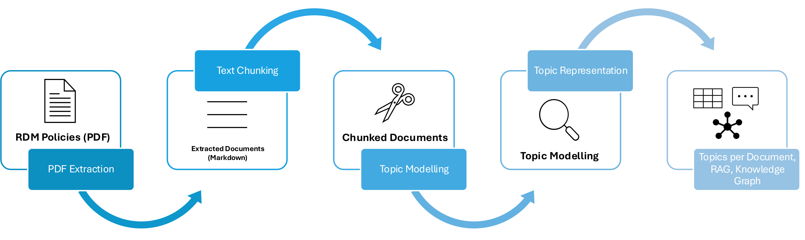

# Uncovering RDM Policies through Topic Modeling

Big data and data-driven methods in research have increased interest in guidelines and processes for handling research data, including data acquisition, data sharing, data retention, and many more topics, which are known as Research Data Management (RDM). While RDM is governed by research institutes through RDM policies, the policy documents developed or adopted by organizations may vary in focus and structure. This thesis applies topic modelling to identify commonalities found in RDM policies, helping policymakers create and improve existing policies, and helping researchers learn about key RDM concepts to promote better RDM practices. Further, this work introduces a topic-based retrieval-augmented generation for accessing and summarizing implementations of common clauses in a conversational format. Additionally, a Knowledge Graph is created, connecting policies and topics to facilitate explainable comparison.

This project uses a four-step methodology for extracting and representing topics from RDM policies:

